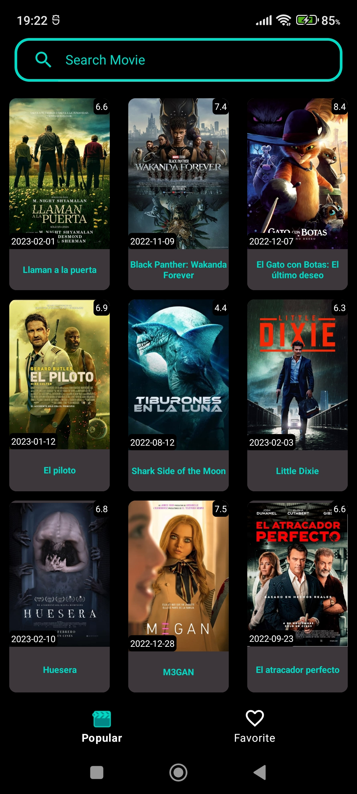
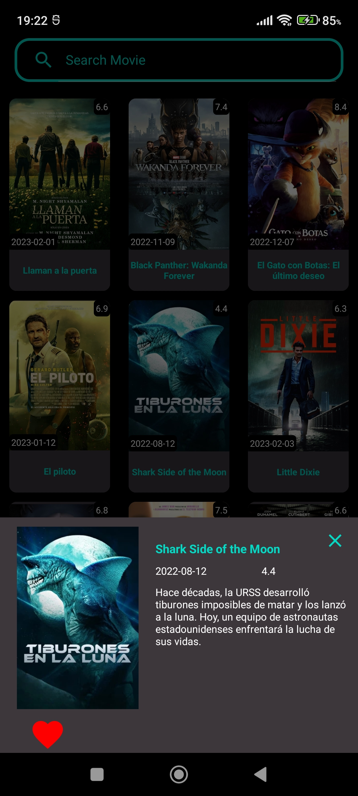
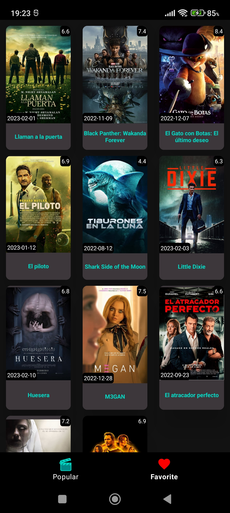

# The Movie Data Base API - MVVM - HILT - ROOM

 

Application to practice the consume of <b>API'S</b>, in this case the API of <b>The Movie Data Base</b>

  

    
    
    
  

# Technologies used in this app
- Presentation architecture -> MVVM
- Architecture -> Clean
- Json Converter -> Gson
- HTTP Client -> Retrofit2
- Firebase -> Analytics & Crashlytics
- Database -> Room
- Dependency injection -> Dagger Hilt
- Unit Testing -> Mockito
# Credits
- [The Movie Data Base API](https://rickandmortyapi.com/)
